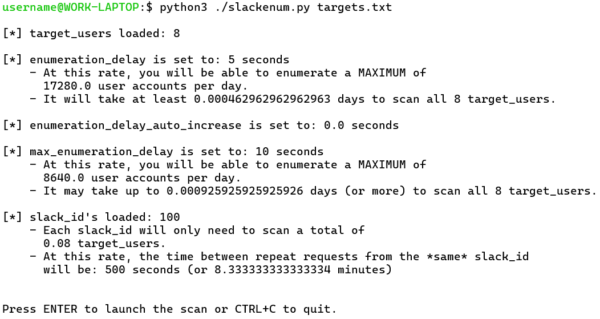
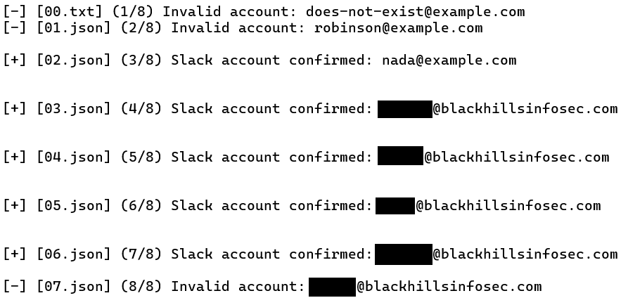

# SlackEnum

A user enumeration tool for Slack.


## Setup

Clone this repository and install the necessary dependencies with the commands below.

```
git clone https://github.com/Wh1t3Rh1n0/SlackEnum

cd SlackEnum

python3 -m pip install -r requirements.txt
```


## Basic usage


Usage:

```bash
python3 slackenum.py <TARGET/TARGETS LIST> [--sanity]
```

- `<TARGET/TARGETS LIST>` - May be either a single email address or a file containing one email address per line.
- `--sanity` - Option to "sanity check" all Slack identities before launching a long running user enumeration job.


## Instructions

1. Create one or more Slack user accounts from which to execute user enumeration. (Referred to as "Slack identities" or "Slack IDs".) Multiple accounts (100 or more) are recommended to perform user enumeration at higher/useable speeds.
2. Log into each user account you've created and join the users to the same Slack workspace.
3. While logged into Slack, use the [CookieBro](https://addons.mozilla.org/en-US/firefox/addon/cookiebro/) browser extension to export your cookies in JSON format. Save the exported cookies to a file in the `slack_ids-cookiebro` folder included with this repository.
4. Repeat steps 2 and 3 for every additional user account you want to use with SlackEnum.
5. Edit the settings at the top of `slackenum.py`. At a minimum, you must change the `default_host` setting to the Slack subdomain of your workspace. 
 
Example:

```python
# The hostname of the workspace where all your Slack IDs reside.
default_host = 'YOUR-WORKSPACE.slack.com'
```

6. Optionally sanity check your Slack IDs before launching a real enumeration campaign by targeting a known-valid Slack account and including the `--sanity` flag.

Example:

```bash
python3 slackenum.py jsmith@example.com
```

7. When everything is ready, start enumerating users.

```bash
python3 slackenum.py targets.txt
```

When SlackEnum first launches, it will print statistics about:
- the number of Slack IDs you have loaded, 
- the number of users you are targeting, 
- your timing options,
- and some estimations of how long enumeration could take, based on all of those factors.



If you press Enter to continue, enumeration will begin and the output will look similar to the output below.



Output is also logged to the `output_file` and `error_log` defined in the settings at the top of `slackenum.py`. By default, these are `slack-users.csv` and `errors.txt`.

